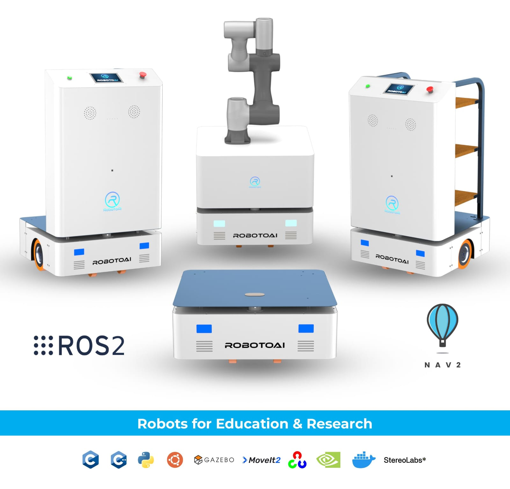

# Dynominion

A ROS 2–based open-source Autonomous Mobile Robot platform featuring 80 kg payload capacity, robotic arm integration, and modular hardware for robotics education and applied research.



## Features

- **High Payload Capacity**: Supports up to 80 kg for versatile applications.
- **Modular Hardware**: Designed for easy customization and research.
- **ROS 2 Integration**: Built on the latest ROS 2 framework for robust performance.
- **Simulation Support**: Includes Gazebo worlds and virtual robot model for simulation.

## Installation

1.  **Clone the repository**:
    ```bash
    mkdir -p ~/ros2_ws/src
    cd ~/ros2_ws/src
    git clone https://github.com/TeamRobotoAI/dynominion.git
    ```

2.  **Install dependencies**:
    ```bash
    cd ~/ros2_ws
    rosdep install --from-paths src --ignore-src -r -y
    ```

3.  **Build**:
    ```bash
    colcon build
    source install/setup.bash
    ```


### Real Robot
For operating the physical robot, refer to the [Dynominion X Real Robot Guide](dynominion_x/REAL_README.md).

### Simulation
For simulation usage, refer to the [Dynominion X Simulation Guide](dynominion_x/SIM_README.md).

## Structure

This repository contains the following packages:

| Package | Description |
|---------|-------------|
| [`dynominion_description`](dynominion_description/README.md) | Robot URDF/Xacro models and visualization. |
| [`dynominion_gazebo`](dynominion_gazebo/README.md) | Gazebo simulation environments and plugins. |
| [`dynominion_navigation`](dynominion_navigation/README.md) | Navigation2 stack configuration. |
| [`dynominion_slam`](dynominion_slam/README.md) | SLAM (Simultaneous Localization and Mapping) setup. |
| [`dynominion_x`](dynominion_x/README.md) | Entry point for real robot and simulation documentation. |
| [`teleop_robot`](teleop_robot/README.md) | Teleoperation nodes for manual control. |

### File Tree
```
dynominion  
├── dynominion_description  
├── dynominion_gazebo   
├── dynominion_navigation   
├── dynominion_slam   
├── dynominion_x        
├── LICENSE     
├── README.md   
└── teleop_robot    
```

## License

This project is licensed under the terms found in the [LICENSE](LICENSE) file.
