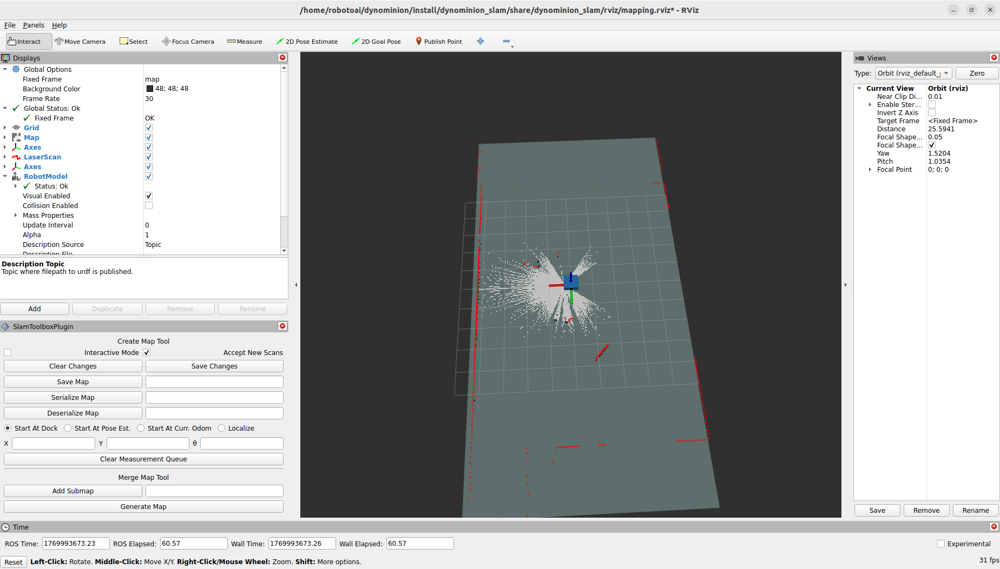

# DYNOMINION X Simulation

### Launch

Dynominion X simulation has multiple launch files for its operation. The following passages are in the form of description of launch file and launch command.

1. To launch Gazebo simulation, run

```bash
ros2 launch dynominion_gazebo dynominion_gazebo.launch.py
```


2. To start mapping with online async mode, run

```bash
ros2 launch dynominion_slam online_async_launch.py
```



3. To start navigation, run

```bash
ros2 launch dynominion_navigation dynominion_nav_bringup.launch.py
```


